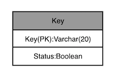
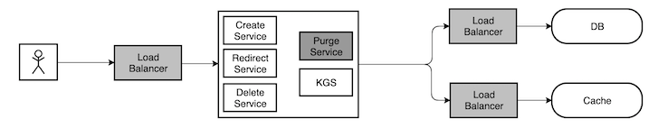

# Tiny URL
Let us design a URL shortening service to provide a short URL for a respective long URL. This service is also helps in redirecting to the respective long URL upon requested a short URL.

- [Need of Tiny URL](#need-of-tiny-url)
- [Requirement and System  Goal](#requirement-and-system--goal)
   * [Functional Requirement](#functional-requirement)
   * [Non-Functional Requirement](#non-functional-requirement)
   * [Extended Requirement](#extended-requirement)
   * [Capacity Estimation and Constraints](#capacity-estimation-and-constraints)
      + [Traffic Estimates](#traffic-estimates)
      + [Storage Estimates](#storage-estimates)
      + [Bandwidth Estimates](#bandwidth-estimates)
      + [Memory Estimates](#memory-estimates)
      + [High-Level Estimates](#high-level-estimates)
- [System APIs](#system-apis)
   * [Parameters](#parameters)
   * [Return](#return)
   * [Parameters](#parameters-1)
   * [Return](#return-1)
   * [How do we prevent abuse?](#how-do-we-prevent-abuse-)
- [Database Design](#database-design)
   * [Database Schema](#database-schema)
      + [Which kind of database should we use?](#which-kind-of-database-should-we-use-)
- [Basic System Design and Algorithms](#basic-system-design-and-algorithms)
   + [Encoding the actual URL](#encoding-the-actual-url)
   + [Key Generation Service (KGS)](#key-generation-service--kgs-)
      - [Can concurrency create a problem here?](#can-concurrency-create-a-problem-here-)
      - [Storage need for KGS?](#storage-need-for-kgs-)
      - [Is the KGS DB is a single point of failure?](#is-the-kgs-db-is-a-single-point-of-failure-)
- [DB Partitioning And Replication](#db-partitioning-and-replication)
   * [Range Based Partitioning](#range-based-partitioning)
   * [Hash Based Partitioning](#hash-based-partitioning)
- [Caching](#caching)
   * [How much memory we need?](#how-much-memory-we-need-)
   * [What cache eviction policy best fits to our requirements?](#what-cache-eviction-policy-best-fits-to-our-requirements-)
- [Load Balancer](#load-balancer)
- [Purging and Cleanup](#purging-and-cleanup)
- [Architecture Diagram](#architecture-diagram)
- [Analytics](#analytics)
- [Security and Permissions](#security-and-permissions)

## Need of Tiny URL
URL shortening is used to create small URL alias for a long URL. Users get redirected to the actual url when they visit the short ones. Short URLs are ideal to use in messages, advertisement and tweets. Someone tends to type this correctly as compared to the long URLs.

For example the long URL could be 

    https://github.com/karasatishkumar/system-design-lab

The respective short URL could be 

    https//tu.com/Adf1Ed3B

## Requirement and System  Goal
The Tiny URL should meet the following requirements

### Functional Requirement
1. Given a long URL the system should generate a short unique URL. This link should be short enough to easy copied and pasted to any content. Anyone should easily copy this url to any device.
2. When a user access the short url the system should redirect it to the respective long URL.
3. User should optionally pick the key for the short URL.
4. The short link should be expired after a default period and user should able to specify the expiration while creating one.

### Non-Functional Requirement
1. The system should be highly available. If the system goes down, it would stop redirecting the actual URL for the given short URL.
2. URL redirection should happen with minimum latency.
3. Tiny URL should not be guessable from the original URL.

### Extended Requirement
1. Analytics on the usage. It would be helpful in case of an advertisement campaign.
2. Private URL. Access based on the user role.
3. REST API, CLI(Python)
4. Billing or Metering

### Capacity Estimation and Constraints
This service would be read heavy i.e. the number of redirection would be more than the creation of the new URL. Let's assume the read/ write ratio to be 100:1.

#### Traffic Estimates
Let's assume we will have 500 Million create requests every month and as per the ratio will get 50 B redirection requests.
    
    500 M * 100 =>  50000 M => 50 B

Create request per second
    
    500 M / (30 Days * 24 hours * 60 Minutes * 60 Seconds) => ~ 192/s

Redirection Requests per second as per 100:1 read/ write ratio

    192 * 100 => ~ 19200/s

#### Storage Estimates
Let's say we will store a URL information for max 5 years. Assuming 500 Million requests per month, will have max 30 Billion URL entities in our system.

    500 M * (12 Months * 5 Years) => ~30000 M => ~30 B 

Let's assume a URL information would be got max 1 KB. With that the total storage would be 30 TB.

    30 B * 1 KB => 30 B KB => ~30000000 MB => ~30000 GB => ~30 TB

#### Bandwidth Estimates
With the above two estimates, inbound request per second would be 192 KB/s and out going would be 19.2 MB/s.

    192 * 1 KB => ~192 KB/s
    19200 * 1 KB => 19200 KB/s => ~19.2 MB/s

#### Memory Estimates
If we assume 20% of the total URLs for a day generate maximum traffic, we would like to store them in our application for a faster access.

    20 % * 19200 * (24 hours * 60 minutes * 60 seconds) => ~0.33 Billion URLs

Assuming 1 URL takes 1 KB we will need 331 GB of memory for caching them.

    0.33 B * 1 KB => ~331 GB

Please note as there would be many duplicate URLs for a day, our memory consuption would be very less.

#### High-Level Estimates
Assuming there will be 500 million create requests per month with a 100:1 read/write ratio following are the summary of the estimations.

    * New URLs : 192/s
    * Redirect URLs : ~ 19200/s
    * Incoming Data : ~ 192 KB/s
    * Outgoing Data : ~ 19.2 MB/s
    * Storage : ~ 30 TB
    * Memory : ~ 331 GB

## System APIs
We will have two APIs here as part of the system, one would be to create a URL and one would be for deleting. 

    create(api_key, original_url, custom_alias=None, expiry_in_days=None)

### Parameters
* api_key : API key to access the APIs. API keys can be given per user account of the service.
* original_url : The long URL
* custom_alias : Custom alias from the user. Creation will happen based on the availability
* expiry_in_days : The number of days you want to retain the URL. This is always capped by 5 years.

### Return
On successful creation it returns the tiny url. Appropriate error codes would be returned based on the use case.

    delete(api_key, alias)

### Parameters
* api_key : API key to access the APIs. API keys can be given per user account of the service.
* alias : URL alias that need to be removed

### Return
Code based on the success or failure.

### How do we prevent abuse?
A user can flood our system by multiple fake requests. To stop this we can put throttling based on api_key.

## Database Design

We will have to consider the problem while modelling entities keeping partitioning in mind. Quick overview of the problem statement would help us coming up with the right solution here.

1. We need to store billions of records
2. As per the analysis the data would be less
3. There are no relationship between the records. Only we need to track all the URLs created by a user.
4. Out service is read-heavy.

### Database Schema
We need two tables here one is for user data and one for the URL data.

#### Which kind of database should we use?
Since we don't have any relationship between tables and we have to store billions of records, we would be selecting a NoSQL database like Casandra, DynamoDB or Riak. We can easily scale with these databases.

## Basic System Design and Algorithms
The problem here we are solving is how to generate an unique key for a given URL.

The last section after the forward slash of the url below is the unique key that has to be generated for a given URL. 
    
    https//tu.com/Adf1Ed3B

Let's discuss few solutions to the problem.

#### Encoding the actual URL
First we can generate a hash of the original URL which will be 32 character in length and then can do a base 64 encoding on it. At the end of these operations it would generate a key of length more than 32 characters. But taking more than 32 character is too much as it would contribute to the overall length of the URL. Let's say we cut that to just initial 6 character and we still can have 68.7 Billion M combinations with base 64 encoding. Having a total record count of ~30 Billion for 5 years. We should be good here. 

    64^6 => 68.7 Billion

If we somehow solve this problem, what about the uniqueness problem? Will the initial 6 characters be unique? What happens if different user provide same url? Looking at all these use case, we still feel if we can maintain the uniqueness of our hash using this technique. 

#### Key Generation Service (KGS)
When generating an unique key is not so straight forward, it would be better to build a separate standalone application whose sole responsibility would be to generate and provide unique 6 character key. This service can generate keys before hand and serve the request with one marking used. With this not only we have to worry about same url from different users also it would be unique for sure.

##### Can concurrency create a problem here? 
If there are multiple requests, there is a fair possibility of same key being served twice.

To solve this problem we can have a status column on the same table to mark a key as used. In our code we should always try to mark the status as used before serving the key. The marking can continue till the time you get a lock. On successful marking the key can be served to the requester. 

As we see it would take some time for a process to pick the key in a loaded scenario, it would be handy if we can populate the few keys in memory as part of a job to decrease the latency of serving. But if the server goes down abruptly, we might waste few keys. But that's okay if we go back and look at the combinations versus need. Else we can always run a job to check the URL table for any inconsistecy and clean them.

##### Storage need for KGS?
If we opt for 6 character key assuming 1 byte for on character. We need 412.3 GB storage.
    
    64^6 * 1 KB * 6 (character per key) = ~412.3 GB

##### Is the KGS DB is a single point of failure?
Yes, we can have a secondary DB in case of a primary fail to rule out the problem for all DBs.

## DB Partitioning And Replication
To scale our DB we need partitioning, so that billions of records can be distributed among different servers.

### Range Based Partitioning
We can pick the Created Datetime field to define a range partitioning. But there would be cases where creation of the new URLs might not be well distributed with date resulting in bad distribution of the data.

### Hash Based Partitioning
We can apply hash based partitioning on the Alias field, so that mod on hash would distribute the data evenly. 

This approach still overload a partition which can be solved using Consistent Hashing. 

## Caching
We can cache URLs for quick access. We can pick any of the self caching solutions like Memcache or Redis for this. Application can check the cache always for the presence else can hit database.

### How much memory we need?
As discussed earlier we can go for 20% of the daily traffic and can change this based on the usage in future. As estimated we need ~331 GB of memory initially.

### What cache eviction policy best fits to our requirements?
Least Recently Used (LRU) can be a reasonable policy for our system. We can always remove the least used url from our cache to acomodate a new URL.

To further increase the efficiency we can replicate the cache server for a faster access.

## Load Balancer
We can add load balancer in three places
1. Client and Application Server
2. Application Server and Database Server
3. Application Server and Cache Server

Initially we can use a simple LB based on Round Robin policy  which will distribute the traffic based on simple rotation. This LB is simple to implement without much overhead. This LB will table out a dead server automatically from the list and stop sending the requests. 

Round Robin does not consider the load on the server and in a loaded environment we could encounter latency problems. To solve this problem intelligent hardware LBs can be used.

## Purging and Cleanup
It is better to clean the expired URLs from the system in a very lazy way when there would not be much load on the system. While purging the URLs we can also clean up those used keys for future consumption. 

## Architecture Diagram

## Analytics
It's sometime useful to trace few details about the access of a URL. For example geographical location of the access, origin web page, date, time etc. But if we start keeping this in DB it would slow down the system. So I guess this all can be captured in log and can then be redirected to a Big Data ecosystem for analytics.

## Security and Permissions
We can have access control on the URLs, but I don't see any viable need for that in this case. Tiny URLs are mostly used for advertisement campaign and posts in social media where it's always required to be public. But we can extend the solution if there is a need for it.

    

    
