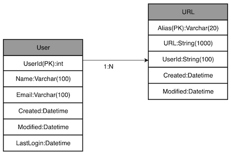

# Tiny URL
Let us design a URL shortening service to provide a short URL for a respective long URL. This service is also helps in redirecting to the respective long URL upon requested a short URL.

## Need of Tiny URL
URL shortening is used to create small URL alias for a long URL. Users get redirected to the actual url when they visit the short ones. Short URLs are ideal to use in messages, advertisement and tweets. Someone tends to type this correctly as compared to the long URLs.

For example the long URL could be 

    https://github.com/karasatishkumar/system-design-lab

The respective short URL could be 

    https//tu.com/Adf1Ed3B

## Requirement and System  Goal
The Tiny URL should meet the following requirements

### Functional Requirement
1. Given a long URL the system should generate a short unique URL. This link should be short enough to easy copied and pasted to any content. Anyone should easily copy this url to any device.
2. When a user access the short url the system should redirect it to the respective long URL.
3. User should optionally pick the key for the short URL.
4. The short link should be expired after a default period and user should able to specify the expiration while creating one.

### Non-Functional Requirement
1. The system should be highly available. If the system goes down, it would stop redirecting the actual URL for the given short URL.
2. URL redirection should happen with minimum latency.
3. Tiny URL should not be guessable from the original URL.

### Extended Requirement
1. Analytics on the usage. It would be helpful in case of an advertisement campaign.
2. Private URL. Access based on the user role.
3. REST API, CLI(Python)
4. Billing or Metering

### Capacity Estimation and Constraints
This service would be read heavy i.e. the number of redirection would be more than the creation of the new URL. Let's assume the read/ write ratio to be 100:1.

#### Traffic Estimates
Let's assume we will have 500 Million create requests every month and as per the ratio will get 50 B redirection requests.
    
    500 M * 100 =>  50000 M => 50 B

Create request per second
    
    500 M / (30 Days * 24 hours * 60 Minutes * 60 Seconds) => ~ 192/s

Redirection Requests per second as per 100:1 read/ write ratio

    192 * 100 => ~ 19200/s

#### Storage Estimates
Let's say we will store a URL information for max 5 years. Assuming 500 Million requests per month, will have max 30 Billion URL entities in our system.

    500 M * (12 Months * 5 Years) => ~30000 M => ~30 B 

Let's assume a URL information would be got max 1 KB. With that the total storage would be 30 TB.

    30 B * 1 KB => 30 B KB => ~30000000 MB => ~30000 GB => ~30 TB

#### Bandwidth Estimates
With the above two estimates, inbound request per second would be 192 KB/s and out going would be 19.2 MB/s.

    192 * 1 KB => ~192 KB/s
    19200 * 1 KB => 19200 KB/s => ~19.2 MB/s

#### Memory Estimates
If we assume 20% of the total URLs for a day generate maximum traffic, we would like to store them in our application for a faster access.

    20 % * 19200 * (24 hours * 60 minutes * 60 seconds) => ~0.33 Billion URLs

Assuming 1 URL takes 1 KB we will need 331 GB of memory for caching them.

    0.33 B * 1 KB => ~331 GB

Please note as there would be many duplicate URLs for a day, our memory consuption would be very less.

#### High-Level Estimates
Assuming there will be 500 million create requests per month with a 100:1 read/write ratio following are the summary of the estimations.

    * New URLs : 192/s
    * Redirect URLs : ~ 19200/s
    * Incoming Data : ~ 192 KB/s
    * Outgoing Data : ~ 19.2 MB/s
    * Storage : ~ 30 TB
    * Memory : ~ 331 GB

## System APIs
We will have two APIs here as part of the system, one would be to create a URL and one would be for deleting. 

    create(api_key, original_url, custom_alias=None, expiry_in_days=None)

### Parameters
* api_key : API key to access the APIs. API keys can be given per user account of the service.
* original_url : The long URL
* custom_alias : Custom alias from the user. Creation will happen based on the availability
* expiry_in_days : The number of days you want to retain the URL. This is always capped by 5 years.

### Return
On successful creation it returns the tiny url. Appropriate error codes would be returned based on the use case.

    delete(api_key, alias)

### Parameters
* api_key : API key to access the APIs. API keys can be given per user account of the service.
* alias : URL alias that need to be removed

### Return
Code based on the success or failure.

### How do we prevent abuse?
A user can flood our system by multiple fake requests. To stop this we can put throttling based on api_key.

## Database Design

We will have to consider the problem while modelling entities keeping partitioning in mind. Quick overview of the problem statement would help us coming up with the right solution here.

1. We need to store billions of records
2. As per the analysis the data would be less
3. There are no relationship between the records. Only we need to track all the URLs created by a user.
4. Out service is read-heavy.

### Database Schema
We need two tables here one is for user data and one for the URL data.

#### Which kind of database should we use?
Since we don't have any relationship between tables and we have to store billions of records, we would be selecting a NoSQL database like Casandra, DynamoDB or Riak. We can easily scale with these databases.

## Basic System Design and Algorithms
The problem here we are solving is how to generate an unique key for a given URL.

The last section after the forward slash of the url below is the unique key that has to be generated for a given URL. 
    
    https//tu.com/Adf1Ed3B

Let's discuss few solutions to the problem.

#### Encoding the actual URL
First we can generate a hash of the original URL which will be 32 character in length and then can do a base 64 encoding on it. At the end of these operations it would generate a key of length more than 32 characters. But taking more than 32 character is too much as it would contribute to the overall length of the URL. Let's say we cut that to just initial 6 character and we still can have 68.7 Billion M combinations with base 64 encoding. Having a total record count of ~30 Billion for 5 years. We should be good here. 

    64^6 => 68.7 Billion

If we somehow solve this problem, what about the uniqueness problem? Will the initial 6 characters be unique? What happens if different user provide same url? Looking at all these use case, we still feel if we can maintain the uniqueness of our hash using this technique. 

#### Key Generation Service (KGS)

    

    
